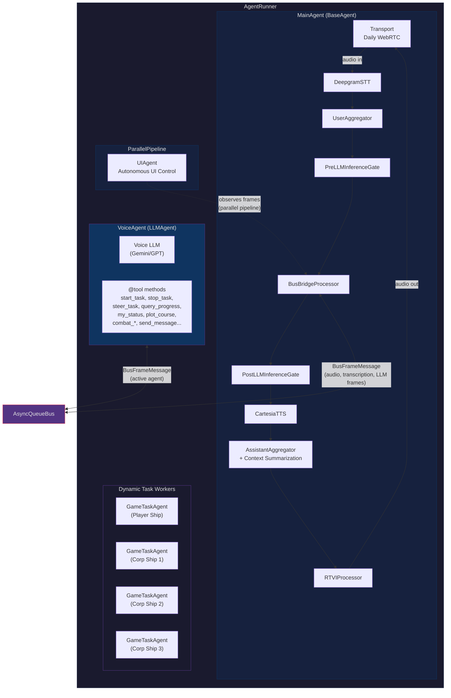
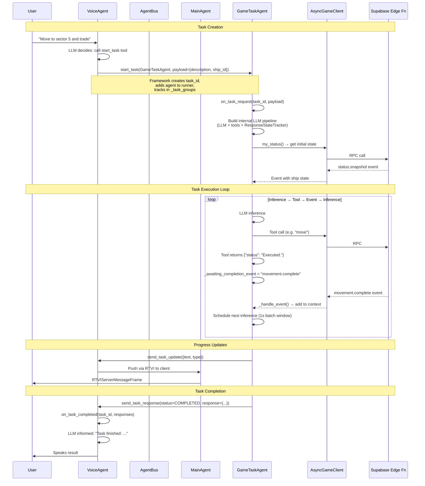
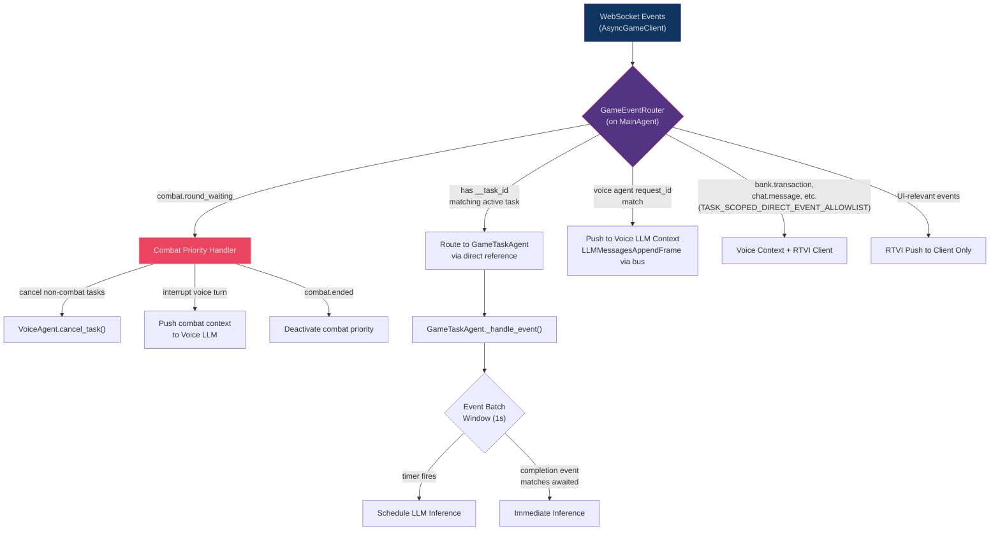
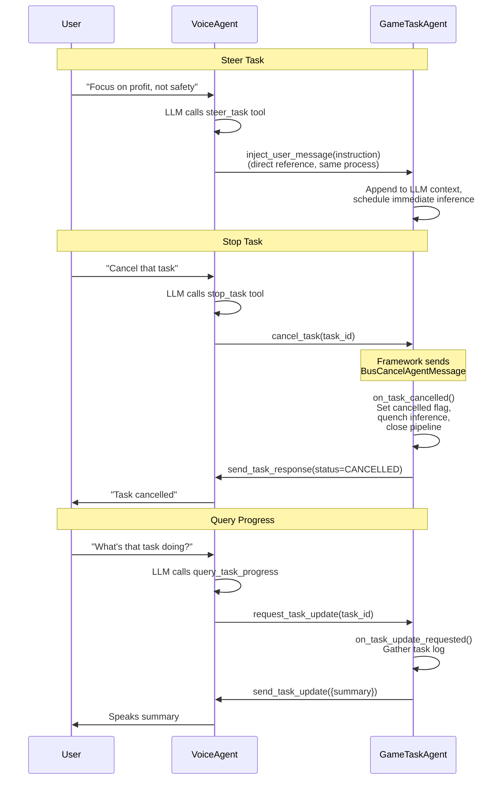
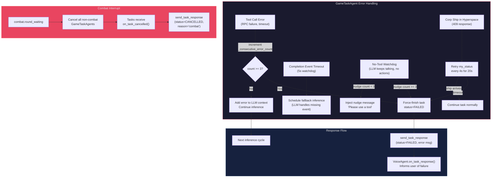
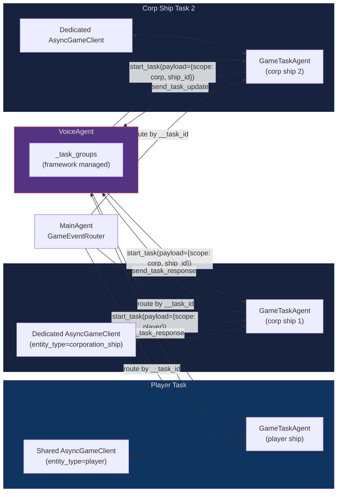

# Pipecat SubAgents Architecture

## Agent Hierarchy & Orchestration

## Task Lifecycle

## Event Routing

## Task Control (Steer / Stop / Query)

## Failure Modes & Recovery

## Corp Ship Multi-Task Concurrency

